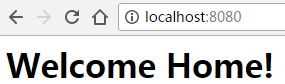
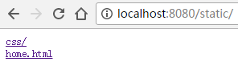
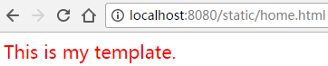

# File Server

This is an example for web server implemented in Go. This server  support two kinds requests:
* Normal requests for non-static files
* File system requests for static files

> In this example, all static files are in `static` folder.

## Results

* Normal request

* Folder request

The file server will return the folder structure, and list all content in the folder.

* File request

The file server will return the content of the file specified in the request path.

