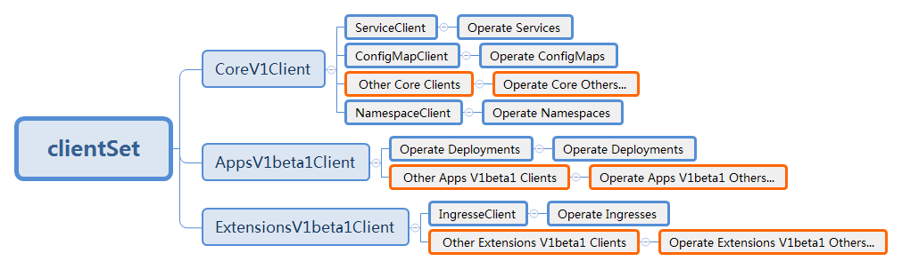
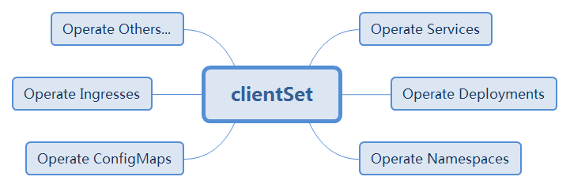

# K8s Go Client

This k8s go client is based on the [official k8s go client](https://github.com/kubernetes/client-go), but is much easier to use.

## Advantages

### Analysis of Official K8s Go Client

Architecture of official k8s go client:

Usage of official k8s go client:
1. New the clientset;
2. Get the group client and new the resource client with specified namespace;
3. Operate this type of resources in this namespace through this resource client.

Disadvantages of official k8s go client:
* Need to know which API group the resource belongs to;
* Resource client can not be reused across different namespaces and different resource types;
* It is complex and memory wasting to frequently new resource clients.

So official k8s go client is suitable for operating fixed resource type in fixed namespace.
It is not good at operate different type of resources in different namespaces at the same time.

### Advantages of This K8s Go Client

The architecture of this k8s go client:

Usage of this k8s go client:
1. New the clientset;
2. Operate any resources in any namespace through this clientset.

Advantages of this k8s go client:
* No need to know which API group the resource belongs to;
* This clientset can directly operate all resources across all namespaces;
* It is easy and memory saving as no need to frequently new resource clients.

The detailed usage can be refered in [examples](./examples). You can compare its [deployment management example](./examples/deployment-management) with the similar [deployment example](https://github.com/kubernetes/client-go/tree/master/examples/create-update-delete-deployment) from official k8s go client.